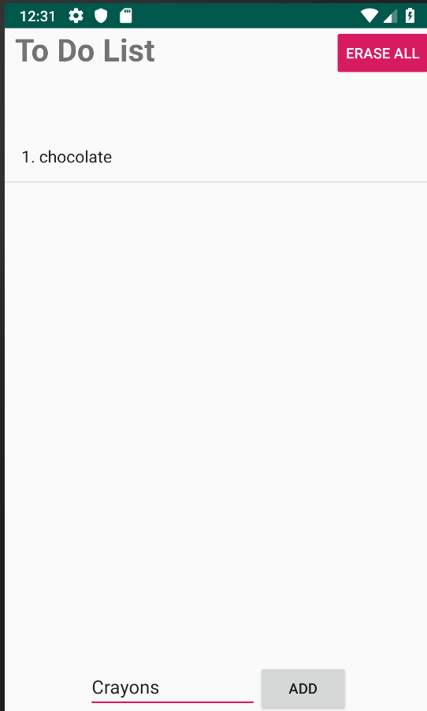
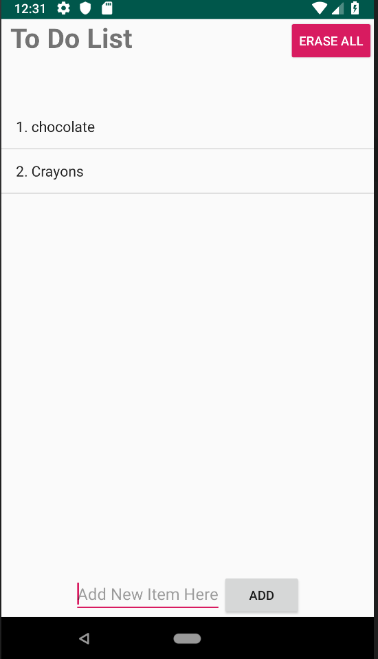

# To-Do-List
A to do list Android app that can be used to add or remove items

## Flow of the Program is given below
<h3>Welcome Screen</h3>

This is The Welcome Screen which contains all the items in the todo list.
 A long Press of Each Item Deletes it. Also, Erase All deletes all items in the list 
After Adding Crayons we go to the next image

